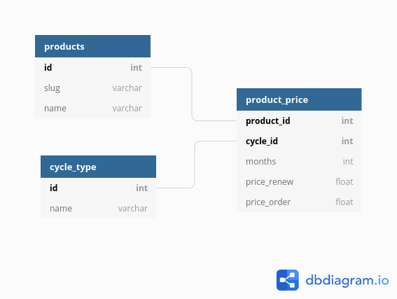

# HostGator Latin America - Full Stack Challenge

## Introduction

This is my take on the HostGaor Latin America Full Stack challenge.

If you're only interest in seeing the end result, and have `docker` and `docker-compose` available, go directly to [Running with docker](#running-with-docker). Otherwise, to run locally you will want to see [Running locally](#running-locally).

If you're interested on what was done, and wasn't, why some decisions were made, etc, keep reading the next sections.

## Backend

As requested, the backend application should run connecting to a MySQL database, and the DB schema should be inferred from the sample JSON data given with the challenge. As such, I used [DB Diagram](https://dbdiagram.io/home) to create the following model (you can also view it on [this link](https://dbdiagram.io/d/5eb94ac039d18f5553ff0433)):



The backend application was made in Golang, using the [Gin Framework](https://github.com/gin-gonic/gin) and connects to a real database. The project has the following folder structure:

```text

├── Dockerfile
├── Makefile
├── api
│   ├── aux_test.go        -- auxiliary functions for API testing
│   ├── testdata           -- auxiliary test files
│   ├── challenge.go       -- required challenge endpoints
│   ├── challenge_test.go  -- tests for the required endpoints
│   ├── error.go
│   ├── param.go
│   ├── product.go         -- extra endpoints
│   ├── product_test.go    -- test for the extra endpoints
│   └── server.go          -- simple server implementation
├── app
│   └── app.go             -- 'entities' mapping
├── go.mod
├── go.sum
├── main.go                -- application entry point
├── migrations
│   ├── migrations.go      -- database migration logic
│   └── mysql              -- migration sql files
├── store
│   ├── challenge.go       -- database functions for the challenge
│   └── product.go         -- database functions for the exta endpoints
├── tools.go               -- required tools
├── start.sh               -- startup script
└── wait-for-it.sh
```

First, the **api** package contains the definition of the endpoints, as well as a simple server struct to hold the database connection. The challenge required only two GET APIs, for `/prices` and `/prices/{id}`, but to better demonstrate how to define and handle different HTTP verbs, I created `api/products.go`, that defines a very simple "CRUD-like" functionality for products. Be wary that since they're more of a "demo" of sorts, these extra endpoinds only handle the information about products themselves, not the related pricing information.

You should also notice that the methods that handle the endpoints are private (lowercase), and are accompanied with a large block of comment annotations. These comments are used to generate the swagger documentation at compile time.

The **app** directory only has the "domain" mapping between database and JSON. It is a simple struct, used only in the extra products endpoint and, if these extra endpoints didn't exist, this struct would not have been created. Neverthless, it is useful to demonstrate how database mapping can be done in Go.

The **store** package contains routines that access the database. The `store/products.go` is as straightforward as it gets (*FindBy*, *Exists*, *Insert*, *Update*), however, it is `store/challenge.go` that has the required code for the challenge. This file has only one function, that builds an SQL command with the needed joins to retrieve the entire information in one roundtrip,mapping it ot an inline `struct`. This, in turn, is looped and processed to build a serie of `map[string]interface{}` to replicate the JSON format required for the challenge.

The **migrations** package exports only a single function, `Run`, that combines both `pkger` and `sql-migrate` to check and run database migrations. Last, but not least, `main.go`  ties everything together, connectiong to the database, running migrations and starting a server on port `8080`.

It is important to note that the Swagger docs and the packing of the migrations SQL files (they're embed on the final executable) is handled by external tools, and these tools are listed on `tools.go`, that **is not compiled into the application**, but is considered as dependency for Go Modules. This means that the necessary version of these external tools are actually *pinned* for this application.

The `start.sh` and `wait-for-it.sh` scripts aren't needed to run the application; they're only used on docker, to wait for the MySQL container to run and be able to accept connections.

## Frontend

The frontend is a pretty standard [CRA Application](https://github.com/facebook/create-react-app). Most of the code and images is directly inside the `src` directory. The *"PascalCase.js* files refers to React components, while the *cameCase.js* files refer to 'plain' javascript files (as in "non-react components"). Of these, the most interesting ones are `RadioGroup.js` (because it has an accompaining `.test.js` file) and `App.js` that has both state and redux logic and represents the main application window.

The `product` folder has all the components used to display the list of products. They are only complex design-wise, because they don't really do much in practice.

The `redux` folder has the store configuration function (`redux/configureStore.js`) and the "products" state module, in a [Ducks-like pattern](https://github.com/erikras/ducks-modular-redux). This module also has a test file.

An interesting fact about this frontend project is that it doesn't use CSS (well... apart for the initial `layout.css`), [LESS](http://lesscss.org/) or [SASS](https://sass-lang.com/), opting instead to use [CSS-in-JS](https://en.wikipedia.org/wiki/CSS-in-JS), using the [Emotion](https://emotion.sh/docs/introduction) library. This means that all the styling was made from scratch (no Bootstrap, MaterialUI or similar were used) and can be seen directly on the javascript code of the components. The JSX code is also more semantic because no *"className mangling"* is needed.

The layout is also responsive, and was made for mobile first. This means that tablet and desktop layouts are the **exception** not the **rule**. The `@media-query` rules are embed on the components, and are "shared" to the entire application by using the `mq.js` an interpolated javascript strings. Take a look at, for example, `src/Header.js`, the `Logo` component uses this technique to make the margin bigger on `desktop` layouts.

Also note that `App.js` uses both redux and the state hook. I'm aware that you don't **need** to do that in this case (you could solve everuthing on redux, or in state), but I choose to mix the two to demonstrate how they can be used for different kinds of state.

## Running locally

To compile and run the backend code, you will need and Linux environment with Golang 1.13+ and a MySQL server available. The compilation is simple, just `cd` into the backend directory and run `make`:

```bash
# go to the backend directory
# since this is a GO MOD project, make
# sure you're OUTSIDE your $GOPATH
cd backend

# build the project.
# this will take a while, because it will download the required packages,
# install the needed tools, run the code generation and only then
# package the final executable
make

# now, run the backend.
$ ./backend
Using the following configuration values:
  DB_DRIVER   =  mysql
  DB_URL      =  hg:hg@/hg?parseTime=true
  APP_PORT    =  8080
  SERVER_NAME =  localhost

- Swagger doc location:  http://localhost:8080/swagger/doc.json
- Swagger doc index:  http://localhost:8080/swagger/index.html
- Connecting to database...OK!
- Running migrations...OK!
[GIN-debug] [WARNING] Creating an Engine instance with the Logger and Recovery middleware already attached.

[GIN-debug] [WARNING] Running in "debug" mode. Switch to "release" mode in production.
 - using env:  export GIN_MODE=release
 - using code: in.SetMode(gin.ReleaseMode)

[GIN-debug] GET    /swagger/*any             --> github.com/swaggo/gin-swagger.CustomWrapHandler.func1 (3 handlers)
[GIN-debug] GET    /prices                   --> github.com/ibraimgm/backend/api.(*Server).getPrices-fm (4 handlers)
[GIN-debug] GET    /prices/:id               --> github.com/ibraimgm/backend/api.(*Server).getPricesByID-fm (4 handlers)
[GIN-debug] GET    /product/:id              --> github.com/ibraimgm/backend/api.(*Server).getProduct-fm (4 handlers)
[GIN-debug] POST   /product                  --> github.com/ibraimgm/backend/api.(*Server).insertProduct-fm (4 handlers)
[GIN-debug] PUT    /product/:id              --> github.com/ibraimgm/backend/api.(*Server).updateProduct-fm (4 handlers)
[GIN-debug] DELETE /product/:id              --> github.com/ibraimgm/backend/api.(*Server).deleteProduct-fm (4 handlers)
[GIN-debug] Listening and serving HTTP on :8080
```

The previous command assumes you have access to a local MySQL instance, with the user **hg**, password **hg** and database name **hg**, and runs on port `8080`. If you want to configure this information, the `DB_URL`, `APP_PORT` and `SERVER_NAME` environment variables can be set (there is no configuration files or command-line flags, everything is from environment vars). Notice that the values being used for these variables are also printed on screen, for convenience.

To run the frontend code, you will need NodeJS 13+. The steps are similar to the backend project:

```bash
# go to the frontend directory
cd frontend

# install npm dependencies
npm install

# run the development server
npm start
```

If the backend is running on `http://localhost:8080`, everything should be working. If, for some reason, the backend is running on other port/location, you can use the environment variable `REACT_APP_API_URL` **before** starting the application, e.g. `export REACT_APP_API_URL=http://myserver:8888` (notice the lack of `/` at the end of the path).

## Running with docker

Docker is the easiest way to get everything running locally. Just go to the root project directory and try:

```bash
$ docker-compose up --build
(... a lot of text ...)
```

This will download the `mysql` and `adminer` images, build the backend and frontend images locally, and start all the services.
Since the backend requires `mysql` to be online and to accept connections, keep an eye on your terminal until you see that the `backend` did start successfully (if it fails, it waits for 30 seconds and tries again.)

It is normal to fail one or more times during the initialization, because MySQL sometimes it is available but doesn't accept connections. Just wait a bit more and keep an eye on the log, until you see something like:

```text
backend_1   | [GIN-debug] Listening and serving HTTP on :8080
```

Once you see that, this means that the backend is up and running, so you should have the following services available:

- An adminer instance on [http://localhost:9000/](http://localhost:9000/). If you put `hg` as user, password and database, and `mysql`  as server name, you can connect and browse the database application directly.
- The backend API, at [http://localhost:8080](http://localhost:8080)
- The swagger documentation, on [http://localhost:8080/swagger/index.html](http://localhost:8080/swagger/index.html). You can also use the swagger page to call the endpoints, for testing.
- The frontend application, at [http://localhost:3000/](http://localhost:3000/).

Once you're done testing, you can clean up by using `Ctrl+C` on the `docker-compose` terminal. If you also want to remove the containers, run `docker-compose down`. Lastly, if you want to wipe out the data, remember to `docker volume rm` the appropriate volume (or simply `docker volume prune`, if you're feeling adventurous).

If you want, you cna customize the `docker-compose.yml` file. I put all the relevant environment variables, with their default values in this file, so you can easily play around if you need. To close the subject, here are a few extra pointers about the `Dockerfile`s and the `doker-compose.yml`:

1. Yes, I know I don't need to expose the MySQL port. I did this to aid you, the evaluator, if you wish to look at the database directly. The same can be said about the inclusion of the `adminer` interface.
2. Yes, I know I'm running Gin on debug mode. Again, this was made on purpose so yiu can see the application log, if you wish.
3. Yes, I know CRA projects should not `npm start` in production. In real world, they should be build with `npm build` and then, the production build should be served e. g. by NGINX or something similar. Since this is a **demonstration**, I choose to keep it as simple as possible to aid the evaluator on it's job.

I guess this is all. If you have any doubts/problems, feel free to contact me.
